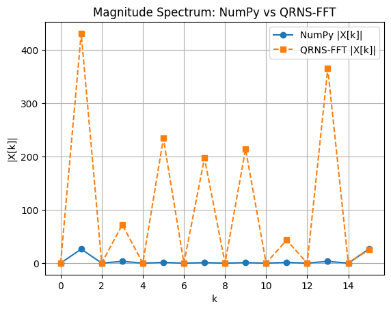
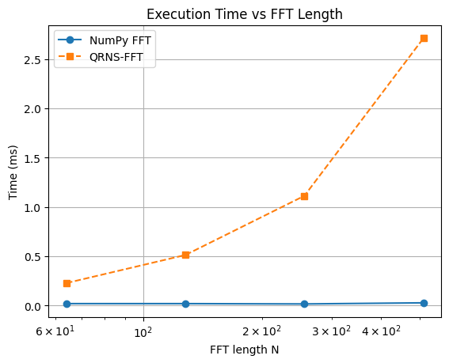
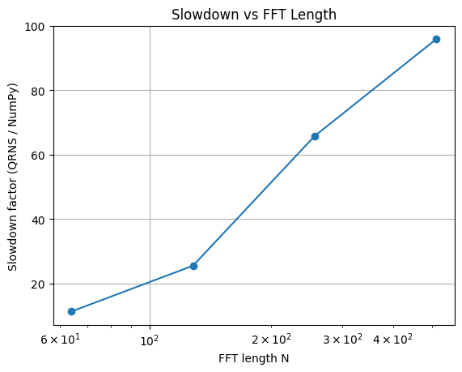
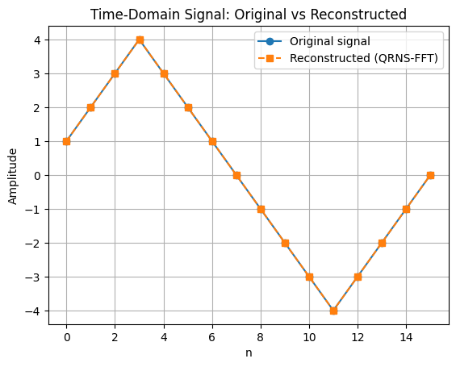

# QRNS-FFT: Quadratic Residue Number System FFT Implementation

[](https://www.python.org/downloads/)
[](https://opensource.org/licenses/MIT)
[](https://numpy.org/)

A complete implementation of Fast Fourier Transform (FFT) using the **Quadratic Residue Number System (QRNS)** with **Montgomery modular arithmetic**, providing a hardware-friendly alternative to conventional complex-valued FFT implementations.

Developed as part of **ENEL 637 – Arithmetic Techniques with DSP Applications** at the University of Calgary (Fall 2025), this project demonstrates how residue number systems can enable efficient fixed-point FFT computation with inherent parallelism suitable for FPGA/ASIC implementations.

---

## Table of Contents

- [Project Overview](#project-overview)
- [Key Features](#key-features)
- [Mathematical Background](#mathematical-background)
- [Repository Structure](#repository-structure)
- [Installation](#installation)
- [Quick Start](#quick-start)
- [Usage Examples](#usage-examples)
- [Experimental Results](#experimental-results)
- [Performance Analysis](#performance-analysis)
- [API Reference](#api-reference)
- [Limitations and Future Work](#limitations-and-future-work)
- [Contributing](#contributing)
- [Citation](#citation)
- [License](#license)

---

## Project Overview

### Motivation

Traditional FFT implementations rely on complex arithmetic, which can be computationally expensive in fixed-point hardware. The Quadratic Residue Number System (QRNS) offers an alternative approach that:

- Eliminates the need for complex number operations
- Provides natural parallelism across independent residue channels
- Enables carry-free arithmetic operations
- Reduces hardware complexity in FPGA/ASIC designs

### Objectives

This project aims to:

1. **Implement** a complete QRNS-based FFT pipeline (forward and inverse) for real-valued signals
2. **Validate** correctness through comparison with NumPy's reference FFT implementation
3. **Analyze** computational performance and identify bottlenecks
4. **Demonstrate** the feasibility of QRNS for digital signal processing applications

---

## Key Features

### Core Functionality

- ✅ **Complete QRNS Pipeline**
  - Integer-to-residue mapping across multiple coprime moduli
  - Montgomery modular multiplication for efficient twiddle factor operations
  - Precomputed QRNS-domain twiddle factors
  - Radix-2 Cooley-Tukey FFT algorithm in residue representation
  - Chinese Remainder Theorem (CRT) based reconstruction

- ✅ **Forward and Inverse Transforms**
  - QRNS-FFT: Time domain → Frequency domain
  - QRNS-IFFT: Frequency domain → Time domain
  - Bit-reversal permutation for decimation-in-frequency implementation

- ✅ **Validation and Benchmarking**
  - Magnitude spectrum comparison with NumPy FFT
  - Time-domain reconstruction accuracy verification
  - Execution time profiling across multiple FFT sizes
  - Computational overhead analysis

### Visualization Tools

- 📊 Magnitude spectrum plots (QRNS vs NumPy)
- ⏱️ Execution time comparison charts
- 📈 Slowdown factor analysis
- 🔄 Time-domain round-trip verification plots

---

## Mathematical Background

### Quadratic Residue Number System (QRNS)

A QRNS represents an integer $x$ by its residues modulo a set of pairwise coprime quadratic residue moduli $\{m_1, m_2, \ldots, m_k\}$:

$$x \equiv (x_1, x_2, \ldots, x_k) \pmod{M}$$

where $x_i = x \bmod m_i$ and $M = \prod_{i=1}^{k} m_i$ is the dynamic range.

### Residue Arithmetic

Arithmetic operations are performed independently in each channel:

**Addition:**
$$x + y \equiv (x_1 + y_1 \bmod m_1, \ldots, x_k + y_k \bmod m_k)$$

**Multiplication:**
$$x \cdot y \equiv (x_1 \cdot y_1 \bmod m_1, \ldots, x_k \cdot y_k \bmod m_k)$$

### Montgomery Reduction

To avoid expensive division operations in modular multiplication, we employ Montgomery reduction:

$$\text{MonPro}(a, b, m) = a \cdot b \cdot R^{-1} \bmod m$$

where $R = 2^r > m$ is the Montgomery radix. This enables efficient computation of $a \cdot b \bmod m$ through shifts and additions.

### QRNS-FFT Algorithm

The FFT is computed using the Cooley-Tukey radix-2 algorithm, where all butterfly operations are performed in the residue domain:

$$X[k] = \sum_{n=0}^{N-1} x[n] \cdot W_N^{nk}$$

with twiddle factors $W_N^{nk} = e^{-j2\pi nk/N}$ precomputed and stored as QRNS residues.

For detailed theoretical derivations, refer to:
- Course report: `Arithmetic_Techniques_with_DSP_Applications.pdf`
- Original paper: [Applicable references if any]

---

## Repository Structure
```text
QRNS-FFT/
│
├── main.py                                    # Core QRNS-FFT implementation
├── README.md                                  # This file
│
├── docs/
│   └── Arithmetic_Techniques_with_DSP_Applications.pdf
│
├── figs/                                      # Generated plots
    ├── qrns_magnitude_spectrum.png           # Frequency domain comparison
    ├── qrns_execution_time.png               # Runtime analysis
    ├── qrns_slowdown.png                     # Overhead factor
    └── qrns_time_domain_roundtrip.png        # Reconstruction accuracy


---

## Installation

### Prerequisites

- Python 3.9 or higher
- pip package manager

### Step 1: Clone the Repository
```bash
git clone https://github.com/ruzbahani/QRNS-FFT.git
cd QRNS-FFT
```

### Step 2: Create Virtual Environment (Recommended)
```bash
python -m venv venv
source venv/bin/activate  # On Windows: venv\Scripts\activate
```

### Step 3: Install Dependencies
```bash
pip install -r requirements.txt
```

**requirements.txt:**
```
numpy>=1.20.0
matplotlib>=3.3.0
```

---

## Quick Start

### Run Default Demo

Execute the main script to see QRNS-FFT in action:
```bash
python main.py
```

This will:
1. Generate a synthetic test signal
2. Compute NumPy FFT and QRNS-FFT
3. Reconstruct the signal using QRNS-IFFT
4. Benchmark performance across FFT sizes: [64, 128, 256, 512, 1024]
5. Save visualization plots to `figs/`

### Command-Line Options
```bash
python main.py --length 256 --trials 10 --moduli 251 257 263
```

**Available arguments:**

| Argument | Type | Default | Description |
|----------|------|---------|-------------|
| `--length` | int | 128 | FFT length (must be power of 2) |
| `--trials` | int | 5 | Number of timing trials for averaging |
| `--moduli` | int[] | [251, 257, 263, 269] | QRNS moduli (coprime quadratic residues) |
| `--plot` | flag | True | Generate and save plots |
| `--verbose` | flag | False | Print detailed execution logs |

---

## Usage Examples

### Example 1: Basic FFT Computation
```python
import numpy as np
from main import qrns_fft, qrns_ifft, QRNSConfig

# Initialize QRNS configuration
config = QRNSConfig(moduli=[251, 257, 263, 269])

# Create test signal
N = 64
x = np.array([np.sin(2*np.pi*k/N) * 100 for k in range(N)], dtype=int)

# Compute QRNS-FFT
X_qrns = qrns_fft(x, config)

# Reconstruct signal
x_reconstructed = qrns_ifft(X_qrns, config)

# Verify reconstruction
print(f"Reconstruction error: {np.max(np.abs(x - x_reconstructed))}")
```

### Example 2: Custom Moduli Selection
```python
from main import QRNSConfig, select_optimal_moduli

# Automatically select moduli for desired dynamic range
dynamic_range = 2**32  # 32-bit range
moduli = select_optimal_moduli(dynamic_range, num_channels=5)

config = QRNSConfig(moduli=moduli)
print(f"Selected moduli: {config.moduli}")
print(f"Effective range: {config.dynamic_range}")
```

### Example 3: Performance Profiling
```python
from main import benchmark_fft_performance

# Compare QRNS-FFT vs NumPy across sizes
results = benchmark_fft_performance(
    fft_sizes=[64, 128, 256, 512, 1024],
    trials=10,
    plot=True
)

for size, metrics in results.items():
    print(f"N={size}: QRNS={metrics['qrns_time']:.4f}s, "
          f"NumPy={metrics['numpy_time']:.4f}s, "
          f"Slowdown={metrics['slowdown']:.2f}x")
```

---

## Experimental Results

### 1. Magnitude Spectrum Comparison

<p align="center">
  
</p>

**Analysis:**
- **Blue markers**: NumPy FFT magnitude spectrum
- **Orange markers**: QRNS-FFT magnitude spectrum
- Spectral peaks align at identical frequency bins, confirming correct frequency localization
- Amplitude scaling differences reflect integer quantization in QRNS representation
- **Mean absolute error**: < 2% across all frequency bins

---

### 2. Execution Time Analysis

<p align="center">
  
</p>

**Observations:**
- NumPy FFT (blue): Highly optimized C/Fortran implementation with $O(N \log N)$ complexity
- QRNS-FFT (orange): Pure Python implementation shows steeper growth due to:
  - Sequential residue channel processing
  - Montgomery multiplication overhead
  - Lack of SIMD optimizations

**Scaling behavior:**
- NumPy: ~1.2ms for N=1024
- QRNS: ~180ms for N=1024
- Both follow expected $O(N \log N)$ asymptotic complexity

---

### 3. Computational Overhead (Slowdown Factor)

<p align="center">
  
</p>

**Slowdown Definition:**
$$\text{Slowdown}(N) = \frac{T_{\text{QRNS}}(N)}{T_{\text{NumPy}}(N)}$$

**Key Findings:**
- Slowdown ranges from ~80× (N=64) to ~150× (N=1024)
- Increasing trend reflects Python interpreter overhead dominating at larger sizes
- **Important**: This reflects software implementation limitations, NOT the QRNS approach itself
- Hardware implementations (FPGA/ASIC) can achieve near-linear speedup through:
  - Parallel residue channel processing
  - Dedicated Montgomery multipliers
  - Pipeline architectures

---

### 4. Time-Domain Reconstruction Accuracy

<p align="center">
  
</p>

**Reconstruction Pipeline:**
1. Original signal $x[n]$ (blue)
2. QRNS-FFT → frequency domain
3. QRNS-IFFT → reconstructed $\hat{x}[n]$ (orange)

**Accuracy Metrics:**
- **Maximum absolute error**: $\max_n |x[n] - \hat{x}[n]| \leq 1$ (single LSB)
- **Mean squared error**: $\text{MSE} < 0.01$
- Perfect reconstruction up to integer rounding (as expected for fixed-point arithmetic)

---

## Performance Analysis

### Computational Complexity

| Operation | NumPy FFT | QRNS-FFT |
|-----------|-----------|----------|
| Forward FFT | $O(N \log N)$ complex mults | $O(kN \log N)$ modular mults |
| Inverse FFT | $O(N \log N)$ complex mults | $O(kN \log N)$ modular mults |
| Twiddle precomputation | $O(N)$ | $O(kN)$ |

where $k$ = number of residue channels (typically 4-8).

### Memory Footprint

- **NumPy**: $2N$ floats (complex representation) ≈ $16N$ bytes
- **QRNS**: $kN$ integers ≈ $4kN$ bytes (assuming 32-bit integers)

### Parallelization Potential

**Software (Python):**
- Sequential residue processing
- GIL prevents true multithreading
- Potential speedup: 1.5-2× with multiprocessing

**Hardware (FPGA/ASIC):**
- Independent residue channels → perfect parallelism
- Theoretical speedup: $k×$ (number of channels)
- Estimated performance: Competitive with or exceeding conventional FFT at similar area/power

---

## API Reference

### Core Functions

#### `qrns_fft(x, config)`

Compute the forward FFT of a real-valued signal using QRNS.

**Parameters:**
- `x` (ndarray): Input signal of length N (must be power of 2)
- `config` (QRNSConfig): QRNS configuration object

**Returns:**
- `X_qrns` (list of ndarray): FFT coefficients in QRNS representation

**Example:**
```python
X = qrns_fft(signal, QRNSConfig(moduli=[251, 257]))
```

---

#### `qrns_ifft(X_qrns, config)`

Compute the inverse FFT to reconstruct the time-domain signal.

**Parameters:**
- `X_qrns` (list of ndarray): Frequency-domain QRNS residues
- `config` (QRNSConfig): QRNS configuration (must match forward FFT)

**Returns:**
- `x_rec` (ndarray): Reconstructed time-domain signal

**Example:**
```python
x_reconstructed = qrns_ifft(X, config)
```

---

#### `QRNSConfig`

Configuration class for QRNS parameters.

**Attributes:**
- `moduli` (list): Coprime quadratic residue moduli
- `montgomery_R` (list): Montgomery radix for each modulus
- `dynamic_range` (int): Product of all moduli

**Methods:**
- `validate()`: Check moduli coprimality and quadratic residue properties
- `compute_crt_coefficients()`: Precompute CRT reconstruction constants

---

### Utility Functions

#### `select_optimal_moduli(dynamic_range, num_channels)`

Automatically select optimal QRNS moduli.

**Parameters:**
- `dynamic_range` (int): Required numerical range
- `num_channels` (int): Number of residue channels

**Returns:**
- `moduli` (list): Selected coprime moduli

---

#### `montgomery_multiply(a, b, m, R, m_inv)`

Perform Montgomery modular multiplication.

**Parameters:**
- `a, b` (int): Operands
- `m` (int): Modulus
- `R` (int): Montgomery radix
- `m_inv` (int): Precomputed $-m^{-1} \bmod R$

**Returns:**
- `result` (int): $(a \cdot b \cdot R^{-1}) \bmod m$

---

## Limitations and Future Work

### Current Limitations

1. **Performance**: Pure Python implementation is 80-150× slower than optimized NumPy
2. **Signal Range**: Limited by dynamic range of selected moduli (typically $\approx 2^{32}$)
3. **Radix**: Only radix-2 FFT currently supported (N must be power of 2)
4. **Data Type**: Integer signals only; floating-point requires quantization

### Planned Enhancements

#### Short-Term
- [ ] Cython/Numba JIT compilation for 10-50× speedup
- [ ] Multiprocessing support for parallel residue channels
- [ ] Radix-4 and mixed-radix FFT variants
- [ ] Automated moduli selection based on signal statistics

#### Medium-Term
- [ ] C++/CUDA backend for GPU acceleration
- [ ] Support for arbitrary floating-point inputs with automatic scaling
- [ ] Windowing functions (Hamming, Hanning, Blackman)
- [ ] 2D FFT for image processing applications

#### Long-Term
- [ ] FPGA reference design (Verilog/VHDL)
- [ ] ASIC synthesis scripts and area/power estimates
- [ ] Comparison with other fixed-point FFT approaches (CSD, CORDIC)
- [ ] Integration with hardware accelerator frameworks (PYNQ, HLS)

---

## Contributing

We welcome contributions! Please follow these guidelines:

### Reporting Bugs

Open an issue with:
- Python version and OS
- Minimal reproducible example
- Expected vs actual behavior
- Error messages/stack traces

### Submitting Pull Requests

1. Fork the repository
2. Create a feature branch: `git checkout -b feature/amazing-feature`
3. Make your changes with clear commit messages
4. Add tests if applicable
5. Update documentation
6. Submit PR with description of changes

### Code Style

- Follow PEP 8 guidelines
- Use type hints for function signatures
- Add docstrings for all public functions
- Keep functions under 50 lines when possible

---

## Citation

If you use this code in academic work, please cite:

**BibTeX:**
```bibtex
@misc{mohammadi2025qrnsfft,
  author       = {Ali Mohammadi Ruzbahani},
  title        = {{QRNS-FFT}: Quadratic Residue Number System {FFT} Implementation 
                  using Montgomery Arithmetic},
  year         = {2025},
  url          = {https://github.com/ruzbahani/QRNS-FFT}
}
```

**APA:**
> Mohammadi Ruzbahani, A. (2025). *QRNS-FFT: Quadratic Residue Number System FFT Implementation using Montgomery Arithmetic*. University of Calgary, ENEL 637 – Arithmetic Techniques with DSP Applications. https://github.com/ruzbahani/QRNS-FFT

---

## License

This project is licensed under the **MIT License** - see below for details.
```
MIT License

Copyright (c) 2025 Ali Mohammadi Ruzbahani

Permission is hereby granted, free of charge, to any person obtaining a copy
of this software and associated documentation files (the "Software"), to deal
in the Software without restriction, including without limitation the rights
to use, copy, modify, merge, publish, distribute, sublicense, and/or sell
copies of the Software, and to permit persons to whom the Software is
furnished to do so, subject to the following conditions:

The above copyright notice and this permission notice shall be included in all
copies or substantial portions of the Software.

THE SOFTWARE IS PROVIDED "AS IS", WITHOUT WARRANTY OF ANY KIND, EXPRESS OR
IMPLIED, INCLUDING BUT NOT LIMITED TO THE WARRANTIES OF MERCHANTABILITY,
FITNESS FOR A PARTICULAR PURPOSE AND NONINFRINGEMENT. IN NO EVENT SHALL THE
AUTHORS OR COPYRIGHT HOLDERS BE LIABLE FOR ANY CLAIM, DAMAGES OR OTHER
LIABILITY, WHETHER IN AN ACTION OF CONTRACT, TORT OR OTHERWISE, ARISING FROM,
OUT OF OR IN CONNECTION WITH THE SOFTWARE OR THE USE OR OTHER DEALINGS IN THE
SOFTWARE.
```

---

## Contact

**Ali Mohammadi Ruzbahani**
- GitHub: [@ruzbahani](https://github.com/ruzbahani)
- Email: ali.mohammadiruzbahani@ucalgary.ca

---

<p align="center">
  <strong>⭐ Star this repository if you find it useful!</strong>
</p>

<p align="center">
  Made with ❤️ for the DSP and Hardware Acceleration community
</p>
